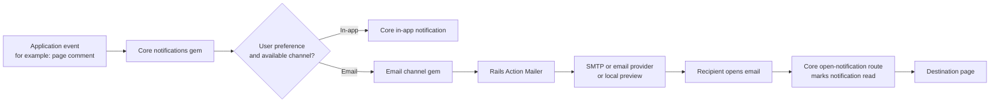

# How Email Works With Recording Studio Notifications

This guide explains how `recording_studio_notifications_email` works with the
core `recording_studio_notifications` gem.

It is written for two audiences:

- Project managers who need to understand what happens when a person receives
  a notification email.
- Developers who need to configure, customize, test, or troubleshoot the
  integration.

## Plain-English Summary

The core notifications gem decides **who should be notified**, **when**, and
**through which channels**. This email gem is one of those channels. When core
decides that an email should be sent, it gives this gem the notification and
asks it to turn the information into an email.

The email gem does not create notification records, decide user preferences,
run retries, or store delivery history. Those responsibilities remain in core.
It focuses on the email-specific work:

1. Find the recipient's email address.
2. Build HTML and plain-text email content.
3. Hand the message to Rails Action Mailer.
4. Report success or failure back through core's existing delivery workflow.



## Responsibilities

The division of responsibility is deliberate. It keeps product rules in one
place and email delivery details in another.

| Concern | Core: `recording_studio_notifications` | Email channel: `recording_studio_notifications_email` |
| --- | --- | --- |
| Notification records | Creates and stores them | Does not store them |
| User preferences | Checks enabled channels and cadence | Receives only eligible work |
| Background jobs and retries | Owns delivery job, retry behavior, and status | Does not create a second job |
| In-app notifications | Renders and manages the inbox | Does not manage the inbox |
| Email recipient address | Supplies recipient object | Resolves email address |
| Email content | Supplies title, body, URL, and context | Selects template and renders message |
| Sending email | Calls the registered channel | Calls Action Mailer `deliver_now` |
| Delivery status | Marks delivery delivered or failed | Lets errors reach the core workflow |
| Marking read | Owns the notification `open` route | Links individual emails to that route |

For a project manager, this means email is not a separate notification system.
It is one delivery method for the same notification a user sees in the app.

## Installation

Add both gems to the host Rails application.

```ruby
# Gemfile

gem "recording_studio_notifications"       # Core notification system.
gem "recording_studio_notifications_email" # Email delivery channel.
```

Then install dependencies and run the email channel installer.

```bash
bundle install
bin/rails generate recording_studio_notifications_email:install
```

What each line means:

- `bundle install` downloads the gems and their dependencies.
- The generator adds a starting configuration file for this email channel.
- The email channel itself requires no database migration and no new inbound
  routes.
- Core notifications still needs its own installation and migrations because
  core owns persistent notification and delivery records.

## Configure a Sender and Recipient Resolution

The email gem needs a valid sender address. It uses `recipient.email` by
default, but an application may define a different address per model type.

```ruby
# config/initializers/recording_studio_notifications_email.rb

RecordingStudioNotificationsEmail.configure do |config|
  config.from = "notifications@example.com"
  # The address displayed as the sender of every email.
  # This is required before a message can be delivered.

  config.reply_to = "support@example.com"
  # Optional. Replies go to support rather than the sender address.

  config.recipients.register(User) { |user| user.notification_email }
  # Optional override for User records.
  # `user` is the notification recipient supplied by core.
  # The block returns one email address, or an array of addresses.
end
```

If no resolver is registered for a recipient's class, the default is
`recipient.email`.

A recipient cannot receive an email when their resolver returns a blank or
invalid address. The delivery is marked failed by core, rather than silently
sending to an unknown destination.

## Tell Core Which Notifications May Use Email

Notification types are registered in the core gem. Add `:email` to the
channels where email is an appropriate product behavior.

```ruby
# config/initializers/recording_studio_notifications.rb

RecordingStudioNotifications.register_notification_type(
  :page_comment,
  # A stable identifier used when the application creates this notification.

  label: "Page comment",
  # Human-readable label for settings and inbox UI.

  default_channels: %i[in_app email],
  # Channels enabled by default for a new user, subject to product rules.

  available_channels: %i[in_app email],
  # Channels a user may choose in their notification preferences.

  scope: :root,
  # Associates the notification with a Recording Studio root context.

  allowed_cadences: %i[individual daily weekly]
  # Allows immediate emails or grouped digest-style delivery.
)
```

Adding `:email` here does not send every notification automatically. Core still
checks the recipient's settings and cadence. This is useful when a product wants
to offer email but allow people to turn it off or receive a daily digest.

## Create a Notification Through Core

Application code calls the core API. It does not call the email mailer directly.
This is important because the core gem needs to create the notification record,
apply preferences, and create delivery records first.

```ruby
RecordingStudioNotifications.notify(
  notification_type: :page_comment,
  # Must match the registered notification type.

  recipient: user,
  # The person who should receive the notification.

  actor: commenter,
  # Optional. The person or system that caused the event.

  root_recording: workspace_recording,
  # Optional or required depending on the notification type's scope.

  recording: page_recording,
  # Recording Studio context used by the inbox and notification UI.

  title: "New comment on Quarterly roadmap",
  # Short, visible subject-style text.

  body: "Please review the revised launch date.",
  # Supporting detail displayed in the inbox and email.

  url: "/recordings/123/comments/all",
  # The in-app destination after the notification is opened.

  channels: %i[in_app email],
  # Optional explicit channels for this event. Omit to use core defaults.

  idempotency_key: "page-comment/comment-456/user-789"
  # Optional stable key that prevents duplicate notifications for the same event.
)
```

For non-developers: this one call creates a single notification concept, then
lets core decide whether it should appear in the app, arrive by email, or both.

For developers: avoid calling `NotificationMailer` or the email adapter from
business code. Doing so bypasses core's preferences, delivery records, retries,
and idempotency behavior.

## How a Message Is Sent

At Rails boot, the email engine registers itself with core as the `:email`
channel. Conceptually, the registration is:

```ruby
RecordingStudioNotifications.register_channel(
  :email,
  # The channel name core uses in notification configuration.

  RecordingStudioNotificationsEmail.adapter
  # The object core calls when it is ready to deliver an email.
)
```

When core's delivery job processes an eligible email delivery, the adapter:

1. Wraps raw notification data in a presentation-safe `Event` object.
2. Resolves the recipient email address.
3. Selects the template for the notification type.
4. Builds a signed correlation reference.
5. Calls the configured Action Mailer class.
6. Calls `deliver_now` inside core's existing delivery job.

The use of `deliver_now` here is intentional. Core already decided whether work
should be asynchronous and already owns retries. Creating another background
job inside the email adapter would make delivery status harder to trust and
could cause duplicate retries.

## Email Content and Templates

Every individual email has both HTML and plain-text content. The plain-text
version is important for accessible mail clients and systems that do not render
HTML.

The built-in fallback templates are:

```text
recording_studio_notifications_email/notification_mailer/notification
recording_studio_notifications_email/notification_mailer/rollup
```

To give a notification type its own visual treatment, register its template
paths with the notification type.

```ruby
RecordingStudioNotifications.register_notification_type(
  :page_comment,
  label: "Page comment",
  default_channels: %i[in_app email],
  available_channels: %i[in_app email],
  scope: :root,
  allowed_cadences: %i[individual daily weekly],
  individual_mailer: "notification_mailer/individual/page_comment",
  rollup_mailer: "notification_mailer/rollup/page_comment"
)
```

Both paths are optional and omit the `.html.erb` or `.text.erb` suffix. The
email channel uses its bundled individual or rollup template when a path is not
registered.

The host app must provide both files:

```text
app/views/notification_mailer/individual/page_comment.html.erb
app/views/notification_mailer/individual/page_comment.text.erb
app/views/notification_mailer/rollup/page_comment.html.erb
app/views/notification_mailer/rollup/page_comment.text.erb
```

A simple HTML template looks like this:

```erb
<h1><%= @event.title %></h1>
<%# The title supplied by core. Rails escapes output by default. %>

<% if @event.body.present? %>
  <p><%= @event.body %></p>
  <%# Only show supporting text when the notification has a body. %>
<% end %>

<% if @tracked_notification_destination.present? %>
  <p><%= link_to "Open page", @tracked_notification_destination %></p>
  <%# This link first marks the notification read, then redirects to its target. %>
<% end %>
```

## What Happens When Someone Clicks an Email Link

For individual notifications, the email channel gives the template a tracked
link. It points to core's existing notification open route:

```text
/recording_studio_notifications/notifications/:id/open
```

The `:id` is the notification record ID. When the signed-in recipient opens the
link, core performs this sequence:

1. Confirms the notification belongs to the current recipient.
2. Confirms it is visible in the recipient's current context.
3. Sets the notification's `read_at` timestamp when it is unread.
4. Redirects the browser to the notification's original `url`.

This does not create a duplicate notification. It changes the existing record
from unread to read.

Important limitations:

- This behavior applies to the individual notification email flow.
- A custom mailer or a template override must use
  `@tracked_notification_destination` to retain read-on-open behavior.
- Rollups contain multiple notifications, so they need product-specific
  decisions about whether a click marks all items read, one item read, or none.
- Opening an email does not itself mark a notification read. Clicking its
  tracked destination link does.

## Delivery Providers Are Separate From This Gem

This gem uses Rails Action Mailer. It does not require Postmark specifically.
The host application chooses a delivery method.

```ruby
# config/environments/production.rb

config.action_mailer.delivery_method = :smtp
# Use Rails' SMTP delivery adapter.

config.action_mailer.smtp_settings = {
  address: "smtp.example.com",
  port: 587,
  user_name: Rails.application.credentials.dig(:smtp, :user_name),
  password: Rails.application.credentials.dig(:smtp, :password),
  authentication: :plain,
  enable_starttls_auto: true
}
# Credentials are illustrative. Use the settings required by the provider.
```

Postmark, SendGrid, Amazon SES, Mailgun, and a self-managed SMTP server are all
possible choices. The email channel does not care which one is used as long as
Action Mailer is configured to deliver through it.

## Local Development With Letter Opener

Local development usually should not send real email. Letter Opener captures the
email and displays it locally instead.

```ruby
# Gemfile

group :development do
  gem "letter_opener"
  # Captures outgoing messages as local preview files.

  gem "letter_opener_web"
  # Provides a browser-accessible list of those previews.
end
```

```ruby
# config/environments/development.rb

config.action_mailer.delivery_method = :letter_opener
# Send messages to Letter Opener instead of SMTP.

config.action_mailer.perform_deliveries = true
# Still run the delivery action so previews are generated.
```

```ruby
# config/routes.rb

if Rails.env.development?
  mount LetterOpenerWeb::Engine, at: "/letter_opener"
  # Lets developers open previews in the Rails application.
end
```

In a remote development environment such as Codespaces, a local desktop browser
may not exist. The web route is more reliable than expecting Letter Opener to
automatically open a new browser window.

## Delivery token and Troubleshooting

Each email includes the `X-Recording-Studio-Notification-Reference` header. It
is a signed and expiring reference to notification and delivery IDs.

```ruby
reference = RecordingStudioNotificationsEmail::DeliveryToken.verify(header_value)
# Verifies the signature and expiry. Returns nil when invalid or expired.

reference&.notification_id
# The single notification ID for an individual email.

reference&.notification_ids
# All notification IDs for an individual message or a rollup.
```

The reference is for integrity and delivery correlation. It is not encrypted,
not an authorization credential, and should not be exposed as a substitute for
normal application authentication.

Useful troubleshooting questions:

| Question | Where to look |
| --- | --- |
| Was a notification created? | Core notifications table/inbox and application logs |
| Did core create an email delivery? | Core delivery records where `channel` is `email` |
| Did the delivery succeed? | Core delivery status and error message |
| Was a recipient address available? | Email channel recipient resolver and recipient model |
| Which template rendered? | Template registry for notification type and Rails view paths |
| Why did the email not arrive in an inbox? | Action Mailer delivery settings, provider logs, SMTP credentials |
| Why is no preview visible locally? | Letter Opener configuration and `/letter_opener` route |

## Custom Mailers

A host application can use its own mailer class when it supports Action Mailer's
parameterized mailer API.

```ruby
RecordingStudioNotificationsEmail.configure do |config|
  config.mailer_class = "MyNotificationsMailer"
  # String name of a mailer class, resolved by Rails at delivery time.
end
```

The custom class must provide both actions:

```ruby
class MyNotificationsMailer < ApplicationMailer
  def notification
    # Receives params such as event, to, from, template_path,
    # correlation_reference, and tracked_notification_path.
  end

  def rollup
    # Receives events, cadence, period boundaries, recipient information,
    # and correlation data for grouped delivery.
  end
end
```

When replacing templates or mailers, preserve the data that matters to the
product:

- Use `@event.title` and `@event.body` for individual messages.
- Use `@tracked_notification_destination` for an individual email's primary
  link when the product expects a click to mark the notification read.
- Keep both HTML and text alternatives.
- Do not treat the correlation header as a login token or authorization check.

## Security and Reliability Principles

The integration follows several practical rules:

1. Sender and reply-to addresses are validated before sending.
2. HTML templates use normal Rails escaping for interpolated event fields.
3. A signed correlation header supports safe delivery traceability.
4. Core owns authorization when the recipient opens a notification link.
5. Core owns delivery status, retries, and idempotency.
6. The email channel sends through Action Mailer rather than coupling to a
   specific commercial provider.
7. The application should not use email links as proof that a person owns an
   account; normal authentication still applies when opening protected pages.

## Release Checklist

Before enabling email for a new notification type, confirm:

- The type is registered in core.
- `:email` is listed in its available/default channels as intended.
- The email sender is configured.
- Every recipient can resolve to a valid email address.
- HTML and text templates exist, if using a custom template.
- Production Action Mailer/provider credentials are configured.
- A real recipient's preferences permit the email channel.
- Local preview and production delivery paths have both been tested.
- The primary individual-email link uses the tracked notification destination
  when read-on-open behavior is required.

## Key Takeaway

Core notifications is the source of truth for a notification's lifecycle. The
email gem is a focused, replaceable delivery channel. Application code creates
notifications through core; core decides whether email is appropriate; the email
gem renders and delivers that message through Rails Action Mailer.
